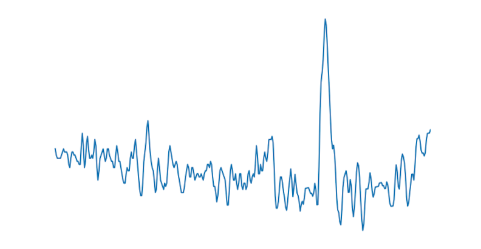
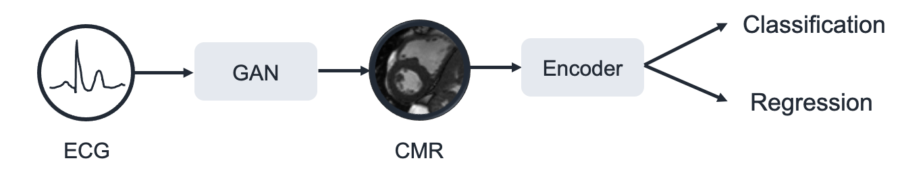
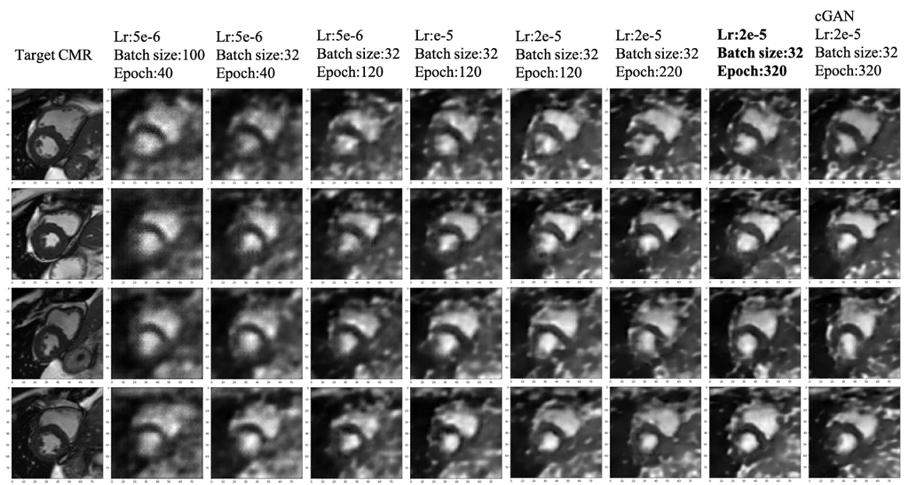
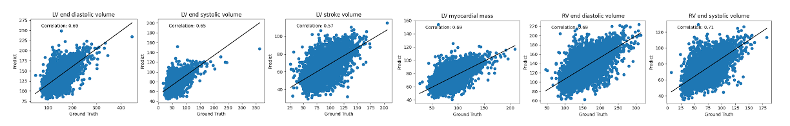
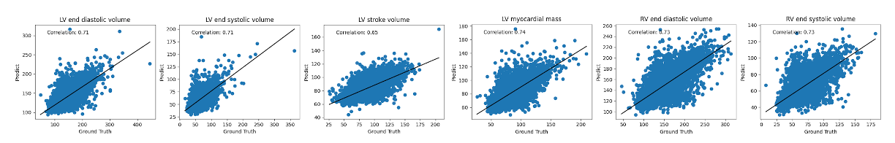
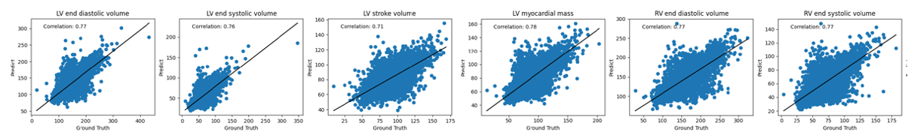

# Heart Health Assessment System Based on ECG and CMR

## Overview
This project develops a novel heart health assessment system that combines electrocardiogram (ECG) data with cardiac magnetic resonance (CMR) imaging. The system leverages generative adversarial networks (GANs) to generate CMR images from ECG data, and then uses advanced deep learning models to predict heart diseases and cardiac phenotypic indicators.

## Background
Cardiovascular diseases remain the leading cause of death globally. While ECG is widely accessible and provides valuable electrical activity information, CMR offers comprehensive structural and functional insights but is expensive and less accessible. This project bridges this gap by generating CMR-equivalent data from ECG signals, allowing for more accessible and comprehensive cardiac assessments.

## Sample Data

### ECG Data Example
ECG signals capture the electrical activity of the heart over time:

### CMR Data Example
CMR images provide detailed structural information about the heart:

## Project Structure
The project consists of two main components:
1. **ECG to CMR Generation**: Using GANs to transform ECG data into corresponding CMR images
2. **Disease Prediction and Health Assessment**: Analyzing the generated CMR images to predict cardiac diseases and estimate cardiac phenotypic indicators

## System Architecture

## Technologies Used
- **Deep Learning Frameworks**: PyTorch
- **GAN Architectures**: Standard GAN, Conditional GAN (cGAN)
- **Encoders**: Vision Transformer (ViT), Swin Transformer
- **Data Processing**: SimpleITK, scikit-learn, NumPy
- **Evaluation Metrics**: AUC (Area Under Curve), Pearson Correlation Coefficient

## Models
### ECG-to-CMR Generation
- **Generator Architecture**: Full connection layers and transpose convolution layers
- **Discriminator Architecture**: Convolutional layers with Sigmoid activation
- **Loss Functions**: 
  - Generator Loss: GAN_loss + λ × L1_loss
  - Discriminator Loss: Real_loss + Generated_loss

### Disease Prediction
- **CNN, ViT, and Swin Transformer** encoders for classification and regression tasks
- **Target Diseases**: Myocardial infarction (I21), Cardiomyopathy (I42), Atrial fibrillation (I48), Heart failure (I50)
- **Cardiac Phenotypic Indicators**: 82 indicators including left/right ventricular end-diastolic volume, end-systolic volume, stroke volume, etc.

## Results

### ECG to CMR Generation Results
The following image shows the progression of GAN training with different parameters:

### Disease Prediction Performance
Comparison of disease prediction performance between different models:

| Model | MI AUC | CM AUC | AF AUC | HF AUC | Mean R |
|-------|--------|--------|--------|--------|--------|
| CNN-ECG | 0.603 | 0.679 | 0.586 | 0.626 | 0.132 |
| CNN-Target CMR | 0.768 | 0.812 | 0.778 | 0.774 | 0.511 |
| CNN-Generated CMR | 0.558 | 0.633 | 0.539 | 0.561 | 0.121 |
| ViT-ECG | 0.624 | 0.555 | 0.627 | 0.677 | 0.245 |
| ViT-Target CMR | 0.671 | 0.642 | 0.722 | 0.713 | 0.512 |
| ViT-Generated CMR | 0.556 | 0.575 | 0.552 | 0.575 | 0.106 |
| Swin-Target CMR | 0.723 | 0.661 | 0.766 | 0.774 | 0.563 |
| Swin-Generated CMR | 0.572 | 0.586 | 0.544 | 0.581 | 0.114 |

### Cardiac Phenotype Prediction
Correlation plots for cardiac phenotypic indicators:

## Dataset
The project used data from the UK Biobank, including:
- 24,908 paired ECG-CMR samples for training
- 8,308 paired samples for testing
- Disease prevalence in the dataset: MI (2%), CM (0.4%), AF (3.9%), HF (1.2%)

## Future Work
- Optimize and improve the GAN architecture for better CMR generation quality
- Integrate multiple data sources for more comprehensive health assessment
- Enhance model interpretability for clinical applications

## Dependencies
- Python 3.x
- PyTorch
- NumPy
- scikit-learn
- SimpleITK
- matplotlib (for visualization)
